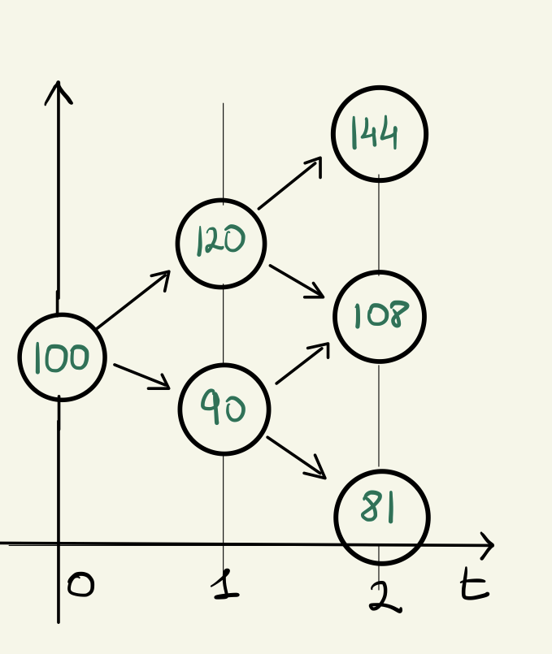
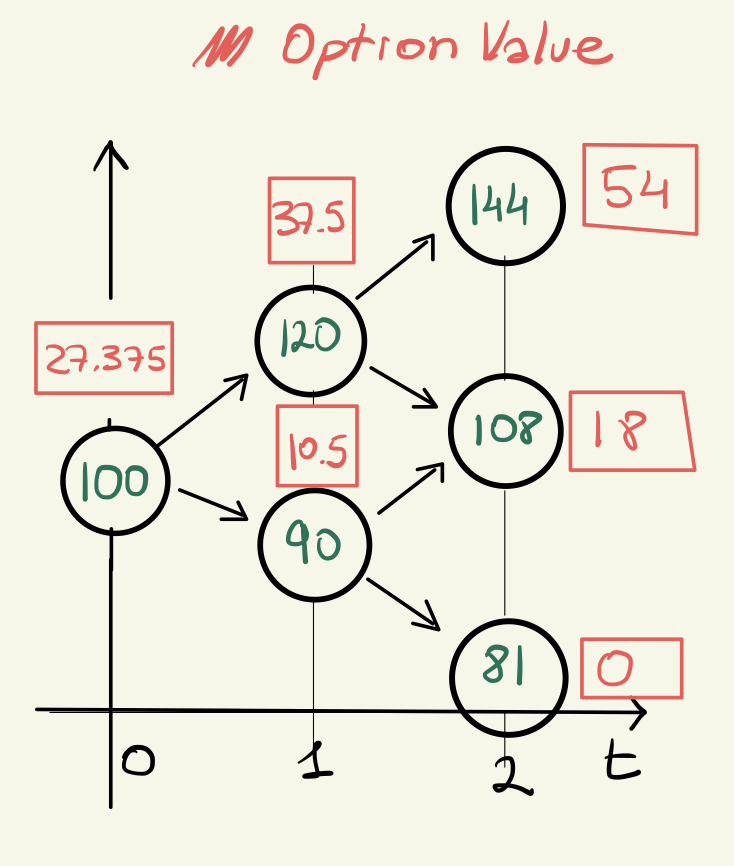
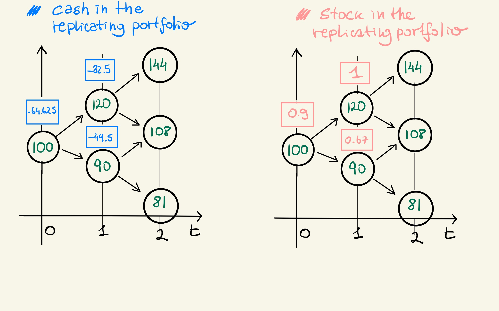

---
title: "Convergence of Random Variables"
header-includes:
   - \usepackage{bbm}
output: 
  pdf_document:
    number_sections: true
---

# Chapter  6

## 6.1

Let $(X_n)$ be a sequence of independent random variables such that:

$$
X_n = \begin{cases}
      2^{-n} & \text{with probability} \ \frac{1}{2}\\
      0 & \text{with probability} \ \frac{1}{2}\\
    \end{cases}  
$$

Show that $X_n \xrightarrow[]{\mathcal{L}^1} 0$ and $X_n \xrightarrow[]{a.s.} 0$.
Deduce that $X_n \xrightarrow[]{\mathbb{P}} 0$ and $X_n \xrightarrow[]{d} 0$.

### Convergence in $\mathcal{L}^1$

We need to prove:

$$
\mathbb{E}[|X_n - 0|] \rightarrow 0
$$
We have:

$$
\mathbb{E}[|X_n - 0|] = \mathbb{E}[X_n] = \frac{1}{2^{n + 1}}
$$
And:
$$
\lim_{n \rightarrow \infty} \frac{1}{2^{n + 1}} = 0
$$
Hence, we have $\mathcal{L}^1$ convergence.

### Almost Sure Convergence

We need to prove:

$$
\mathbb{P}\left [ \left \{ \omega: \lim_{n \rightarrow \infty} X_n(\omega) = 0 \right \} \right] = 1
$$

We have that $0 \leq X_n \leq 2^{-n}$, hence:

$$
0 \leq \lim_{n \rightarrow \infty} X_n(\omega) \leq \lim_{n \rightarrow \infty} 2^{-n} = 0
$$
By the sandwich rule:

$$
\lim_{n \rightarrow \infty} X_n(\omega) = 0
$$
and hence:
$$
\mathbb{P}\left [ \left \{ \omega: \lim_{n \rightarrow \infty} X_n(\omega) = 0 \right \} \right] = 1
$$

### Convergence in Probability and Distribution

Since almost sure convergence implies convergence in probability, and convergence
in probability implies convergence in distribution (lemma 6.1.2), we also have
$X_n \xrightarrow[]{\mathbb{P}} 0$ and $X_n \xrightarrow[]{d} 0$.

## 6.2

Let $X_n, X$ be random variables.

(a) suppose that$X_n \xrightarrow[]{\mathcal{L}^1} X$ as $n \rightarrow \infty$. 
    Show that $\mathbb{E}[X_n] \rightarrow \mathbb{E}[X]$
    
By assumption, we have that:

$$
\mathbb{E}[|X_n - X|] \rightarrow 0
$$

By the Absolute Value property of Expectation and linearity, we have:

$$
0 \leq |\mathbb{E}[X_n - X]| = |\mathbb{E}[X_n] - \mathbb{E}[X]| \leq \mathbb{E}[|X_n - X|] \rightarrow 0
$$
Hence, by the sandwich rule:

$$
|\mathbb{E}[X_n] - \mathbb{E}[X]| \rightarrow 0
$$

And, hence, $\mathbb{E}[X_n] \rightarrow \mathbb{E}[X]$

(b) Give an example where $\mathbb{E}[X_n] \rightarrow \mathbb{E}[X]$ but $X_n$ 
    does not converge to X in $\mathcal{L}^1$
    
A pretty trivial counterexample is any sequence of random variables $X_n$ such 
that $\mathbb{E}[X_n] = 0$, but $\mathbb{E}[|X_n|] \neq 0$ and does not converge
to zero. In that case, by setting $X = 0$, we have that $\mathbb{E}[X_n] = 0 \rightarrow 0 = \mathbb{E}[X]$, 
but $\mathbb{E}[|X_n - 0|]$ does not converge to zero. For example:

$$
X_n = \begin{cases}
      n & \text{with probability} \ \frac{1}{2}\\
      -n & \text{with probability} \ \frac{1}{2}\\
    \end{cases}  
$$
We have that $\mathbb{E}[X_n] = 0$, but:

$$
\mathbb{E}[|X_n - 0|] = \mathbb{E}[|X_n|] = n
$$
which does not converge to $\mathbb{E}[0] = 0$.

## 6.3

Let $U$ be a random variable such that $\mathbb{P}[U = 0] = \mathbb{P}[U = 1] = \mathbb{P}[U = 2] = \frac{1}{3}$.
Let:

$$
X_n = \begin{cases}
      1 + \frac{1}{n} & \text{if} \ U = 0\\
      1 - \frac{1}{n} & \text{if} \ U = 1\\
      0 & \text{if} \ U = 2\\
    \end{cases}  
$$

and:

$$
X = \begin{cases}
      1 & \text{if} \ U \in \{0, 1\}\\
      0 & \text{if} \ U = 2\\
    \end{cases}  
$$

Show that $X_n \xrightarrow[]{\mathcal{L}^1} 0$ and $X_n \xrightarrow[]{a.s.} 0$.
Deduce that $X_n \xrightarrow[]{\mathbb{P}} 0$ and $X_n \xrightarrow[]{d} 0$.

### Convergence in $\mathcal{L}^1$

We need to prove:

$$
\mathbb{E}[|X_n - X|] \rightarrow 0
$$
We have that:

$$
0 \leq |X_n - X| \leq \frac{1}{n}
$$
Hence, by monotonicity of expectation:

$$
0 \leq \mathbb{E}[|X_n - X|] \leq \frac{1}{n}
$$

And by the sandwich rule:

$$
\mathbb{E}[|X_n - X|] \rightarrow 0
$$

### Almost Sure convergence

We need to prove:

$$
\mathbb{P}\left [ \left \{ \omega: \lim_{n \rightarrow \infty} X_n(\omega) = X(\omega) \right \} \right] = 1
$$

We have:

$$
\mathbb{P}\left [ \left \{ \omega: \lim_{n \rightarrow \infty} X_n(\omega) = X(\omega) \right \} \right] = 
$$
$$
\mathbb{P}\left [ \lim_{n \rightarrow \infty} X_n = X  \middle | U = 0 \right]\mathbb{P}[U = 0] + 
\mathbb{P}\left [ \lim_{n \rightarrow \infty} X_n = X  \middle | U = 1 \right]\mathbb{P}[U = 1] +
\mathbb{P}\left [ \lim_{n \rightarrow \infty} X_n = X  \middle | U = 2 \right]\mathbb{P}[U = 2]
$$
$$
\mathbb{P}\left [ \lim_{n \rightarrow \infty} 1 + \frac{1}{n} = 1  \middle | U = 0 \right]\frac{1}{3} + 
\mathbb{P}\left [ \lim_{n \rightarrow \infty} 1 - \frac{1}{n} = 1  \middle | U = 1 \right]\frac{1}{3} + 
\mathbb{P}\left [ \lim_{n \rightarrow \infty} 0 = 0  \middle | U = 2 \right]\frac{1}{3} = 1
$$

### Convergence in Probability and Distribution

Since almost sure convergence implies convergence in probability, and convergence
in probability implies convergence in distribution (lemma 6.1.2), we also have
$X_n \xrightarrow[]{\mathbb{P}} 0$ and $X_n \xrightarrow[]{d} 0$.

## 6.4

Let $X_1$ be a random variable with distribution given by 
$\mathbb{P}[X_1 = 1] = \mathbb{P}[X_1 = 0] = \frac{1}{2}$. Set $X_n = X_1$ for 
all $n \geq 2$. Set $Y = 1 - X_1$. Show that $X_n \rightarrow Y$ in distribution, 
but not in probability.

To show convergence in distribution, we need to prove:

$$
\lim_{n \rightarrow \infty} \mathbb{P}[X_n \leq x] = \mathbb{P}[Y \leq x] \ \forall \ x \in \mathbb{R}: \mathbb{P}[Y = x] = 0
$$
We have:

$$
\mathbb{P}[Y \leq x] = \begin{cases}
  0 & \text{if} \ x < 0\\
  \frac{1}{2} & \text{if} \ x \in [0, 1)\\
  1 & \text{if} \ x \geq 1\\
\end{cases}
$$
Hence, we need to prove convergence in the intervals $(-\infty, 0)$, $(0, 1)$ 
and $(1, \infty)$.

* For $(-\infty, 0)$, we have $\lim_{n \rightarrow \infty}\mathbb{P}[X_n \leq x]  = \mathbb{P}[X_1 \leq x] = 0$.
* For $(0, 1)$, we have $\lim_{n \rightarrow \infty}\mathbb{P}[X_n \leq x]  = \mathbb{P}[X_1 \leq x] = \frac{1}{2}$.
* For $(1, \infty)$, we have  $\lim_{n \rightarrow \infty}\mathbb{P}[X_n \leq x]  = \mathbb{P}[X_1 \leq x] = 1$.

Hence, we have convergence in distribution. Let's now look at convergence in 
probability, which means:

$$
\lim_{n \rightarrow \infty} \mathbb{P}[|X_n - Y| > a] = 0, \ \forall \ a > 0
$$
We have:
$$
|X_n - Y| = |X_1 - Y| = |X_1 - 1 + X_1| = |2X_1 - 1|
$$
If $X_1 = 1$, than we have that $|X_n - Y| = 1$. But also if $X_1 = 0$, than we 
have that $|X_n - Y| = 1$. So, for any $a \in (0, 1]$:

$$
\lim_{n \rightarrow \infty} \mathbb{P}[|X_n - Y| > a] = \mathbb{P}[|2X_1 - 1| > a] \neq 0
$$

And we don't have convergence in probability.

## 6.4

Let $(X_n)$ be the sequence of random variables from 6.1. Define:

$$
Y_n = \sum_{i = 1}^n X_i
$$

* (a) show that $\forall \ \omega \in \Omega$, the sequence $Y_n(\omega)$ is
increasing and bounded.

We have that $X_n(\omega) \geq 0, \forall \ \omega \in \Omega, \forall \ n \geq 0$.
Hence we have that, for any $n$ and $\omega$:

$$
Y_{n + 1}(\omega) = Y_{n}(\omega) + X_{n + 1}(\omega) \geq Y_{n}(\omega)
$$
That is, the sequence $Y_n(\omega)$ is increasing.

Also, we have that:

$$
Y_{n}(\omega) \leq \sum_{i = 1}^n \frac{1}{2^i} 
$$
which, being a geometric series, is bounded. Hence, $Y_{n}(\omega)$ is bounded.

* (b) deduce that there exists a random variable $Y$ such that $Y_n \xrightarrow[]{a.s.} Y$

Given that $Y_{n}(\omega)$ is increasing and bounded for any $\omega$, for the 
Monotone Convergence Theorem for real valued sequence, we have:

$$
\lim_{n \rightarrow \infty} Y_{n}(\omega) = Y_{\infty}(\omega)
$$

for some $Y_\infty(\omega)$. By proposition 2.2.6, we know that $Y_\infty(\omega)$
is a random variable.

This implies that:

$$
\left \{ \omega:  \lim_{n \rightarrow \infty} Y_{n}(\omega) = Y_{\infty}(\omega) \right \} = \Omega
$$
And hence:

$$
\mathbb{P} \left[ \left \{ \omega:  \lim_{n \rightarrow \infty} Y_{n}(\omega) = Y_{\infty}(\omega) \right \} \right] = 1
$$

That is, $Y_n$ converges a.s. to $Y = Y_{\infty}$.

* (c) Write down the distribution of $Y_1, Y_2, Y_3$
* (d) Suggest why we might guess that $Y$ has a uniform distribution on $[0, 1]$
* (e) Prove that $Y_n$ has a uniform distribution on $\{k2^{-n}; k = 0, 1, ..., 2^{n - 1}\}$
* (r) Prove that $Y$ has a uniform distribution on $[0, 1]$

# Chapter 10

## 10.4

(a). Show that $\mathbb{E}[B_t^n] = t(n - 1)\mathbb{E}[B_t^{n - 2}] \ \ \forall n \geq 2$

To simplify notation, let's denote $X = B_t$. By the definition of Brownian 
motion, we know that $X \sim \mathcal{N}(0, t)$. Using the law of the unconscious 
statistician:

$$
\mathbb{E}[X^n] = \int_{-\infty}^{\infty} x^n \frac{1}{\sqrt{2\pi t}} e^{- \frac{x^2}{2t}} dx
$$

Note that what we want is to isolate a term corresponding to 
$\mathbb{E}[X^{n - 2}]$. In order to do so, we need to maintain the term 
corresponding to the normal density. Notice that such term has derivative:

$$
\frac{d}{dx} e^{- \frac{x^2}{2t}} = -\frac{x}{t} e^{- \frac{x^2}{2t}}. 
$$

Hence, we can proceed integrating by parts:

$$
\int_{-\infty}^{\infty} x^n \frac{1}{\sqrt{2\pi t}} e^{- \frac{x^2}{2t}} dx
= \frac{1}{\sqrt{2\pi t}}\int_{-\infty}^{\infty} -tx^{n - 1} (-\frac{x}{t} e^{- \frac{x^2}{2t}}) dx
$$

$$
= \frac{1}{\sqrt{2\pi t}} \left[ \left[ -tx^{n - 1}  e^{- \frac{x^2}{2t}}\right]_{-\infty}^{\infty} -  \int_{-\infty}^{\infty} -t(n - 1)x^{n - 2} e^{- \frac{x^2}{2t}} \right] = \\ 
$$
$$
= t(n - 1) \int_{-\infty}^{\infty} x^{n - 2} \frac{1}{\sqrt{2\pi t}} e^{- \frac{x^2}{2t}} 
= t(n - 1) \mathbb{E}[X^{n - 2}] \\
= t(n - 1) \mathbb{E}[B_t^{n - 2}]
$$

(b). Deduce that $\mathbb{E}[B^2_t] = t$ and $\mathbb{V}ar[B^2_t] = 2t^2$

We have:

$$
\mathbb{E}[B^2_t] = t \mathbb{E}[B^0_t] = t
$$
$$
\mathbb{V}ar[B^2_t] = \mathbb{E}[(B^2_t)^2] - \mathbb{E}[B^2_t]^2 = 
\mathbb{E}[B^4_t] - t^2 = 3t\mathbb{E}[B^2_t] - t^2 = 
2t^2
$$
(c). Write down $\mathbb{E}[B^n_t]$ for any $n \in \mathbb{N}$

We have that

* $\mathbb{E}[B^n_t] = 0$ if n is odd

* $\mathbb{E}[B^n_t] = (n-1)(n-3)...(1) t^{n/2}$ if n is even

We can prove it by induction. For n odd, let's start by observing that 
$\mathbb{E}[B_t] = 0$. We have our base case, $n = 1$. For our inductive case, 
let's assume that for an odd $n - 2$, $\mathbb{E}[B^{n - 2}_t] = 0$. Since 
$n - 2$ is odd, so is $n$. We have:

$$
\mathbb{E}[B^n_t] = t(n - 1)\mathbb{E}[B_t^{n - 2}] = 0
$$
And we're done. As for n even, similarly, we have our base case for $n = 2$:

$$
\mathbb{E}[B^2_t] = t \mathbb{E}[B^0_t] = t = (1) t^{2/2}
$$

As for the inductive case, let's assume that, for n - 2 even:

$$
\mathbb{E}[B^{n - 2}_t] = (n-3)(n-5)...(1) t^{(n - 2)/2}
$$
Then n is also even, and:

$$
\mathbb{E}[B^n_t] = t(n - 1)\mathbb{E}[B_t^{n - 2}] = t(n - 1)(n-3)(n-5)...(1) t^{(n - 2)/2}
$$
$$
 = (n - 1)(n-3)(n-5)...(1) t^{n/2}
$$

(d). Show that $B^n_t \in L^1$ for all $n \in \mathbb{N}$

We know that $\mathbb{V}ar[B^n_t] = \mathbb{E}[B^{2n}_t] - \mathbb{E}[B^n_t]^2 < \infty$, as
both terms on the right hand side are, as we've seen in part (c). We also know 
that $L^2$ is the set of random variables with finite variance, and hence 
$B^n_t \in L^2$. Finally, we know that if a random variable is in $L^2$, then it 
is also in $L^1$. Hence, $B^n_t \in L^1$.

# Chapter 11

## 11.1 Using (11.8) find $\int_v^t 1 dB_u$, where $0 \leq v \leq t$

By the consistency property of Ito integrals:

$$
\int_0^t 1 dB_u = \int_0^v 1 dB_u + \int_v^t 1 dB_u \Rightarrow 
\int_v^t 1 dB_u = \int_0^t 1 dB_u - \int_0^v 1 dB_u
$$

By (10.8):

$$
\int_0^v 1 dB_u = B_v; \ \ \ \int_0^t 1 dB_u = B_t.
$$

Hence:

$$
\int_v^t 1 dB_u = B_t - B_u
$$

## 11.2 Show that the process $e^{B_t}$ is in $\mathcal{H}^2$. (Hint: use (10.2))

We work onver a filtered space $(\Omega, \mathcal{F}, (\mathcal{F}_t), \mathbb{P})$,
where $\mathcal{F}_t = \sigma(B_t)$. We need to show that:

* $e^{B_t}$ is continuous
* $e^{B_t}$ is adapted to $\mathcal{F}_t$
* $e^{B_u}$ is locally square integrable, i.e. $\int_0^t \mathbb{E}[(e^{B_u})^2]du < \infty$

We have that since $B_t$ and $e^x$ are continuous, their composition is 
continuous. Furthermore, given that $B_t$ is adapted by construction, by 2.2.6, 
so is $e^{B_t}$.

As for local square integrability, since $B_t$ is a standard Brownian motion, we 
have that $B_t \sim \mathcal{N}(0, t)$, and, hence, $2B_t \sim \mathcal{N}(0, 4t)$. 

Thus:

$$
\mathbb{E}[(e^{B_u})^2] =\mathbb{E}[e^{2B_u}] = e^{2u}
$$

Where we used (10.2) to calculate the expected value. Hence:

$$
\int_0^t \mathbb{E}[(e^{B_u})^2]du = \int_0^t e^{2u}du = 
\left[ \frac{1}{2}e^{2u} \right]_0^t = \frac{1}{2}(e^{2t} - 1) < \infty
$$
Which proves that $e^{B_t} \in \mathcal{H}^2$.

## 11.3

(a). Let $Z \sim \mathcal{N}(0, 1)$. Show that the expectation of 
$e^{\frac{z^2}{2}}$ is infinite.

We have:

$$
\mathbb{E}\left[e^{\frac{z^2}{2}} \right] = 
\int_{-\infty}^{\infty} e^{\frac{z^2}{2}} \frac{1}{\sqrt{2\pi}} e^{-\frac{z^2}{2}} dz =
\int_{-\infty}^{\infty} \frac{1}{\sqrt{2\pi}} dz =
\infty
$$

(b). Give an example of a continuous, adapted stochastic process that is not in 
$\mathcal{H}^2$

We know that, $X \sim \mathcal{N}(0, t) \Rightarrow \frac{1}{\sqrt{t}}X \sim \mathcal{N}(0, 1)$.
We also know that $B_t \sim \mathcal{N}(0, t)$. Hence, $F_t =\frac{1}{\sqrt{t}} B_t \sim \mathcal{N}(0, 1)$. 

Now, if we take the process $X_t = e^{\frac{1}{4}F_t^2}$ we have:

* $X_t \in m\mathcal{F}_t$, since $B_t \in m\mathcal{F}_t \Rightarrow F_t \in m\mathcal{F}_t$,
  by proposition 2.2.6, and $F_t \in m\mathcal{F}_t \Rightarrow X_t \in m\mathcal{F}_t$, also
  by proposition 2.2.6. Hence, $X_t$ is adapted.

* Since $B_t$ is continuous, and $x^2, e^x, \frac{x}{\sqrt{t}}$ are continuos, 
  so is $X_t$
  
* However, we have:

$$
\mathbb{E}[X_t^2] = \mathbb{E}[e^{\frac{1}{2}F_t^2}] = \infty
$$

And, hence, 

$$
\int_0^t \mathbb{E}[X_u^2] du  = \infty
$$
And $X_t$ is not in $\mathcal{H}^2$. *Note that we can't simply use the* 
*stochastic process $X_t = Z$, because we can't guarantee that such process is adapted.*

# Assignment 1

---
title: "MAS6052 - HW1"
output: pdf_document
---
1. Recall the one-period market, and its parameters $r,u,d,p_u,p_d$ and $s$. 
	We assume that $d < 1 + r < u$.
    a. At time $t = 0$ our portfolio contains 2 unit of cash and 3 units of
    	 stock.  What is the value of our portfolio at time $t = 0$?  If we hold 
    	 this portfolio until time $t= 1$, what is its new value?
    	 
    In our model, the cost of a unit of stock at time 0 is $S_0 = s$. Hence, at 
    time $t = 0$, the value of our portfolio is 2 + 3s. At time t = 1, the value
    of the cash will be $2(1 + r)$, while the value of stock is a random variable.
    The value of the portfolio will be:
    
    \begin{equation}
    V_1 = 
    \begin{cases}
      2(1 + r) + 3su, & \text{with probability}\ p_u\\
      2(1 + r) + 3sd, & \text{with probability}\ p_d\\
    \end{cases}
    \end{equation}
    
    b. A rival investor holds a portfolio containing 3 units of cash and 
       2 unit of stock. Under what condition (on the parameters) can we be 
       certain that our own portfolio will have a strictly greater value at 
       time $t= 1$?
       
    The portfolio of the rival investor, at time $t= 1$, will be worth:
    
    \begin{equation}
    V^*_1 = 
    \begin{cases}
      3(1 + r) + 2su, & \text{with probability}\ p_u\\
      3(1 + r) + 2sd, & \text{with probability}\ p_d\\
    \end{cases}
    \end{equation}
    
    In order to have the certainty that our portfolio will have a strictly greater 
    value at time 1, it will have to have strictly greater value in every possible
    state of the world. That is, we want:
    
    $$
    \mathbb{P}[V > V^*] = 1
    $$
    
    Hence, we need:
    
    \begin{equation}
    \begin{cases}
      2(1 + r) + 3su > 3(1 + r) + 2su \\
      2(1 + r) + 3sd > 3(1 + r) + 2sd
    \end{cases}
    \end{equation}
    
    Which means that we need $su > 1 + r$ and $sd > 1 + r$. Given our assumption
    $d < 1 + r < u$, we know that su > sd, and the first inequality is redundant.
    Thus we have that our portfolio will certainly be worth more, at time $t = 1$,
    if and only if:
    
    \begin{equation}
    sd > 1 + r 
    \end{equation}
    
    In other words, if and only if a unit of stock is worth more than cash in 
    every state of the world at time 1. Note that, since we are assuming $r > 0$, 
    this implies that s > 1, i.e. the stock at time 0 costs more than one unit of
    cash. Also, note that this is different from our no-arbitrage assumption (i.e.
    that $d < 1 + r < u$), as that only requires a non-null probability that the
    stock will **grow** lower than cash, it doesn't impose a condition on the final
    value.

2. Let $\Omega =\{HH,HT,TH,TT\}$, representing two coin tosses each of 
   which may show either $H$ (head) or $T$ (tail). Let $X: \Omega \rightarrow \mathbb{R}$     be the toss in which the first head occurred, or zero if no heads occurred.
   \begin{equation}
    X = 
    \begin{cases}
      0, & \text{if}\ \omega = TT \\
      1, & \text{if}\ \omega = HT \ \text{or}\ \omega = HH\\
      2, & \text{if}\ \omega = TH \\
    \end{cases}
   \end{equation}
   
   Let $Y$ be the total number of heads that occurred in both tosses.
   
   a. Write down the sets $X^{-1}(0)$, $X^{-1}(1)$ and $X^{-1}(2)$
   
       * $X^{-1}(0) = \{TT\}$
       * $X^{-1}(1)= \{HT, HH\}$
       * $X^{-1}(2) = \{TH\}$
   
   b. State the definition of $\sigma(X)$, and ist its elements
   
   $\sigma(X)$ is the $\sigma$-field generated by $X$, i.e., it is the smallest 
   $\sigma$-field containing all the preimages of any subinterval of $\mathbb{R}$
   under X. As X contains a finite set of values {0, 1, 2}:
   
   $$
   \sigma(X) = \{\emptyset, \Omega, \{TT\}, \{HT, HH\}, \{TH\}, ...
   $$
   $$
   ..., \{HT, HH, TH\}, \{TT, TH\}, \{TT, HT, HH\}\}
   $$
   
   c. Is $Y$ measurable with respect to $\sigma(X)$?  Why, or why not?
   
   As $Y$ takes a finite set of values {0, 1, 2}, we can use lemma 2.2.2, and state that 
   it is measurable w.r.t. $\sigma(X)$ iff:
   
   $$
   Y^{-1}(0),Y^{-1}(1), Y^{-1}(2) \in \sigma(X)
   $$
   We can see that while $Y^{-1}(0) = \{TT\} \in \sigma(X), Y^{-1}(1) = \{HT, TH\}  \notin    \sigma(X)$, and $Y^{-1}(2) = \{HH\}  \notin \sigma(X)$. Hence, $Y \notin m\sigma(X)$. Note that this makes intuitive sense. $\sigma(X)$ allows
   us to measure when the first head comes up. It doesn't need to distinguish, for
   example, HH and HT - this information is not relevant for X, as in both these
   outcomes a head comes up in the first throw. 
   On the other hand, HH and HT need to be distinguished by Y, as they imply 
   different numbers of heads. 
   
   
3. Let $\Omega = \{1,2,3,4,5\}$, representing one roll of a five sided dice. 
   Let $\mathcal{F}$ be the set of all subsets of $\Omega$.  Describe, in words, 
   the information contained within the following sub-$\sigma$-fields of $\mathcal{F}$:  
   
    a. $\mathcal{G}_1 = \{\emptyset,\Omega,\{1\},\{2,3,4,5\}\}$
    
    $\mathcal{G}_1$ contains information around whether 1 came up or not.
    
    b. $\mathcal{G}_2 = \{\emptyset,\Omega,\{1,3,5\},\{2,4\}\}$
    
    $\mathcal{G}_2$ contains information around whether the number that came up
    in the roll is odd or even.
    
    c. $\mathcal{G}_3 = \{\emptyset,\Omega,\{1\},\{2,3,4\},\{5\},\{1,2,3,4\},\{2,3,4,5\},\{1,5\}\}$
    
    $\mathcal{G}_3$ contains information around whether the outcome was 1, 5 or 
    a value in the middle of the range. 
    
4. Let $X$ be a random variable.

    a. Show that $Y = \text{cos}X$ is also a random variable
    
    We know that:
    
    $$
    \text{cos}(X) = \lim_{N \to \infty} \sum_{n = 0}^{N} \frac{(-1)^n}{2n!} X^{2n}
    $$
    
    From proposition 2.2.6, we know that
    
    * $Z_n = X^{2n}$, as a product of random variables, is a random variable
    * $\frac{(-1)^n}{2n!} Z_n = \alpha Z_n$, as a product of a real number and a
      random variable, is a random variable
    * $Z_N = \sum_{n = 0}^{N} \alpha Z_n$, as a sum of random variables, is a random
      variable
    * $Y = \lim_{N \to \infty} Z_N$ exists for all $Z_N \in \mathbb{R}$,
      hence is a random variable.
    
    
    b. For which $p \in [1, \infty)$ do we have $Y \in L^p$?
    
    We have that $|Y| \leq 1$, hence $Y$ is bounded. Thus, using monotonicity,
    we have that $\mathbb{E}[|Y|^p| \leq 1 \leq \infty$ for any $p$. Hence, by
    the definition of $L^p$ spaces, $Y \in L^p$ for any $p \in [1, \infty)$.

# Assignment 2

---
title: "MAS6052 - HW2"
output: pdf_document
---
1. Let $(X_n)$ be a sequence of i.i.d. random variables, each with a uniform
    distribution on [-1, 1]. Define:
    $$
    S_n = \sum_{i = 1}^{n} X_i
    $$
    Where $S_0$ = 0. Let $\mathcal{F}_n = \sigma(X_1, X_2, ..., X_n).$

    a. Show that $S_n$ is a martingale with respect to the filtration $\mathcal{F}_n$
    
        By definition 3.3.3, we need to show that:
       
        1. $(S_n)$ is adapted to $\mathcal{F}_n$, i.e., for each n, $S_n \in m\mathcal{F}_n$
        
            By definition of $\sigma$-fields generated by random variables, we have
            that $X_1, X_2, ..., X_n \in m\mathcal{F}_n$. Also, by proposition 2.2.6,
            we know that:
            
            $$
            X, Y \in m\mathcal{G} \Rightarrow (X + Y) \in m\mathcal{G}
            $$
            
            Hence:
            
            $$
            S_n = \sum_{i = 1}^{n} X_i \in m\mathcal{F}_n
            $$
        
        2. $S_n \in L^1 \ \forall n$
           We have:
           
           $$
           |S_n| = |\sum_{i = 1}^{n} X_i| \leq \sum_{i = 1}^{n} |X_i| \leq \sum_{i = 1}^{n} 1 = n
           $$
           
           That is, $S_n$ is bounded. Hence, $S_n \in L^1$
        
        3. $\mathbb{E}[S_{n+1}| \mathcal{F}_n] = S_n$
           We have:
           
           $$
           \mathbb{E}[S_{n+1}| \mathcal{F}_n] = \mathbb{E}[X_{n + 1} + S_{n} | \mathcal{F}_n] =
           $$ 
           $$ 
           = \mathbb{E}[X_{n + 1} | \mathcal{F}_n] + \mathbb{E}[S_{n} | \mathcal{F}_n] = \mathbb{E}[X_{n + 1}] + S_n = S_n
           $$ 
    b. Find $\mathbb{E}[S_3^2 | \mathcal{F}_2]$ in terms of $X_2$ and $X_1$, and hence show that:
    
        $$
        \mathbb{E}[S_3^2 | \mathcal{F}_2] = S_2^2 + \frac{1}{3}
        $$
    
        We have that:
        
        $$
        \mathbb{E}[S_3^2 | \mathcal{F}_2] = \mathbb{E}[(X_1 + X_2 + X_3)^2 | \mathcal{F}_2] = 
        $$
        By the linearity of conditional expectation:
        $$
         = \mathbb{E}[X_1^2 | \mathcal{F}_2] + \mathbb{E}[X_2^2| \mathcal{F}_2] + \mathbb{E}[X_3^2| \mathcal{F}_2]
           + 2\mathbb{E}[ X_1 X_2 | \mathcal{F}_2] + 2\mathbb{E}[X_2 X_3 | \mathcal{F}_2] +
           2\mathbb{E}[X_1  X_3 | \mathcal{F}_2]
        $$
        By the measurability property of conditional expectation:
        $$
         = X_1^2 + X_2^2 + \mathbb{E}[X_3^2| \mathcal{F}_2]
           + 2  X_1 X_2 + 2\mathbb{E}[X_2 X_3 | \mathcal{F}_2] +
           2\mathbb{E}[X_1  X_3 | \mathcal{F}_2]
        $$
        By taking out what it's known:
        $$
         = X_1^2 + X_2^2 + \mathbb{E}[X_3^2| \mathcal{F}_2]
           + 2  X_1 X_2 + 2 X_2 \mathbb{E}[X_3 | \mathcal{F}_2] +
           X_1 2\mathbb{E}[ X_3 | \mathcal{F}_2]
        $$
        By independence:
              $$
         = X_1^2 + X_2^2 + \mathbb{E}[X_3^2]
           + 2  X_1 X_2 + 2 X_2 \mathbb{E}[X_3] +
           X_1 2\mathbb{E}[ X_3 ]
        $$
        Since we know that $\mathbb{E}[X_3] = 0$:
        
        $$
        \mathbb{E}[S_3^2 | \mathcal{F}_2] = X_1^2 + X_2^2 + 2X_1 X_2 = (X_1 + X_2)^2 = S_2^2 + \mathbb{E}[X_3^2]
        $$ 
        
        And we have that:
        
        $$
        \mathbb{E}[X_3^2] = \int_{-1}^{1} \frac{1}{2} x^2 dx = \frac{1}{2} \left [ \frac{x^3}{3} \right ]_{-1}^1 = \frac{1}{3}
        $$
        
        Hence:
        $$
        \mathbb{E}[S_3^2 | \mathcal{F}_2] = X_1^2 + X_2^2 + 2X_1 X_2 = (X_1 + X_2)^2 = S_2^2 + \frac{1}{3}
        $$ 
    
    c. Write down a deterministic function $f: \mathbb{N} \rightarrow \mathbb{R}$ such that:
    
        $$
        M_n = S_n^2 - f(n)
        $$
        
        is a martingale.

        In general, we'll have:
        
        $$
        \mathbb{E}[S_{n + 1}^2 | \mathcal{F}_n] = \mathbb{E}\left [ \left (\sum_{i = 1}^{n + 1} X_i \right)^2 \middle | \mathcal{F}_n \right ] = \mathbb{E}\left [ \left (X_{n + 1} + S_n \right)^2 | \mathcal{F}_n \right ] = 
        $$
        
        $$
        =  \mathbb{E}\left [ X_{n + 1}^2 + 2 X_{n + 1}S_n + S_n^2 | \mathcal{F}_n \right ] = 
        $$
        
        By linearity, taking out what is known and measurability:
        
        $$
        =  \mathbb{E}[ X_{n + 1}^2] + 2S_n\mathbb{E}[X_{n + 1}]  + S_n^2 = \mathbb{E}[ X_{n + 1}^2] + S_n^2 = \frac{1}{3} + S_n^2    
        $$
        
        Hence, if we define $f(n) = \frac{n}{3}$:
        
        $$
        \mathbb{E}[M_{n + 1} | \mathcal{F}_n] = \mathbb{E}[S_{n + 1} - \frac{n + 1}{3}| \mathcal{F}_n]
        $$
        
        By linearity:
        
        $$
        \mathbb{E}[M_{n + 1} | \mathcal{F}_n] = \mathbb{E}[S_{n + 1}^2| \mathcal{F}_n] - \frac{n + 1}{3}
        = S_{n}^2 - \frac{n}{3}
        = S_{n}^2 - f(n) = M_n
        $$
        
        It is easy to prove (but not requested) that $M_n$ is adapted to 
        $\mathcal{F}_n$ and $M_n \in L^1$, and hence is a Martingale.
        

1. Consider the one-period market with $r = \frac{1}{10}, s = 2, d = \frac{1}{2}, u = 3$, 
   in our usual notation. A contract specifies that:
   
   *The holder of the contract will sell 2 units of stock, and be paid K units of cash, at time 1*
   
   a. Explain briefly why the contingent claim of this contract is:
   $$
   \Phi(S_1) = K - 2S_1
   $$
   
   The contingent claim of a contract is a random variable that describes the 
   value of the contract as a function of the price of stock. In our case, the 
   contract enforces the holder to sell two units of stock (hence the term 
   $- 2S_1$) in exchange for K cash (hence the term $+K$)
   
   b. Find a replicating portfolio $h$ for this contingent claim 
   
   A replicating portfolio $h$ is a portfolio such that $V_1^h = \Phi(S_1)$, In 
   other words, we want to find a portfolio that has the same value as the 
   contingent claim in every possible state of the world, that is:
   
   $$
   V_1^h = \begin{cases}
      \Phi(su) & \text{if} \ S_1 = su \\
      \Phi(sd) & \text{if} \ S_1 = sd \\
   \end{cases}  
   $$
   That is, we want to solve the system:
   
   $$
   \begin{cases}
      (1 + r)x + suy = K - 2su \\
      (1 + r)x + sdy = K - 2sd \\
   \end{cases}  
   $$
   We can subtract the equations to find the amount of stock to hold $y$:
   
   $$
   sy(u - d) = 2s(d - u) \Rightarrow y(u - d) = -2(u - d) \Rightarrow y = -2
   $$
   And hence we can substitute this to find the amount of cash to hold $x$:
   
   $$
   (1 + r)x - 2su = K - 2su \Rightarrow x = \frac{K}{(1 + r)} = \frac{10}{11}K
   $$
   
   c. Write down the value $V_0^h$ of h at time 0
   
   $$
   V_0^h = x + sy = \frac{10}{11}K -2s = \frac{10}{11}K -4
   $$
   
   d. Find the numerical values of risk-neutral probabilities:
   $$
   q_u = \frac{(1 + r) - d}{u - d} \ \ \text{and} \ \ q_d = \frac{u - (1 + r)}{u - d}
   $$
   Hence, check that $\frac{1}{1 + r}\mathbb{E}^{\mathbb{Q}}[\Phi(S_1)]$ and 
   $V_0^h$ have the same values.
   
   We have that:
   
   $$
   q_u = \frac{(1 + r) - d}{u - d} = \frac{(1 + \frac{1}{10}) - \frac{1}{2}}{3 - \frac{1}{2}} = 
   \frac{6}{25} 
   $$
   $$
   q_d = \frac{3 - \frac{11}{10}}{3 - \frac{1}{2}} = \frac{2}{5}\frac{19}{10} = \frac{19}{25}
   $$
   Hence:
   
   $$
   \frac{1}{1 + r}\mathbb{E}^{\mathbb{Q}}[\Phi(S_1)] = \frac{1}{1 + r}\left [ q_u\Phi(su) + q_d\Phi(sd) \right] = 
   \frac{10}{11}\left [ \frac{6}{25} (K - 2su) + \frac{19}{25}(K - 2sd) \right] 
   $$
   $$
   \frac{1}{1 + r}\mathbb{E}^{\mathbb{Q}}[\Phi(S_1)] = \frac{10}{11} \left[ K - \frac{110}{25}\right] = \frac{10}{11}K - 4
   $$
   
   e. For which K does the contract have zero value at time 0?
   
   $$
   V_0^h = 0 \Rightarrow \frac{10}{11}K - 4 = 0 \Rightarrow K = 4.4
   $$

# Assignment 3

1. Consider the binomial model with $r = \frac{1}{11}$, $u = 1.2$, $d = 0.9$, 
   $s = 100$ and time steps $t = 0, 1, 2$
   
   a. Draw a recombining tree of the stock price process, for time $t = 0, 1, 2$
   
   {width=30%}
   
   b. Find the value, at time t = 0, of a European call option that gives its 
      holder the option to purchase one unit of stock at time $t = 2$ for a 
      strike price $K = 90$. Write down the hedging strategy that replicatres
      the value of this contract, at all nodes of your tree.
      
   We have that the risk neutral probabilities are:
   
   * $q_u = \frac{(1 + r) - d}{u - d} = 0.64$
   * $q_d = \frac{u - (1 + r)}{u - d} = 0.36$
   
   A European Call has payoff $\Phi(S) = \text{max}(S - K, 0)$. We can determine 
   the value of the European Call at expiration:
   
   * $S = 144 \Rightarrow \Phi(S) = 54$
   * $S = 108 \Rightarrow \Phi(S) = 18$
   * $S = 81 \Rightarrow \Phi(S) = 0$
   
   Now we can proceed recursively and calculate the risk neutral expected value
   at each node. In general, if we are sitting in a node at time t, the value of
   the option at time t is:
   
   $$
   \frac{1}{1 + r} \mathbb{E}^{\mathbb{Q}}[S_{t + 1}]
   $$
   
   {width=30%}
   
   We find that the option value at time zero is 27.375.
   
   By using the delta hedging formula, we can find our replicating portfolio at 
   each node of the tree:
   
   $$
   x = \frac{1}{1 + r}\frac{u\Phi(sd) - d\Phi(su)}{u - d}
   $$
   $$
   y = \frac{\Phi(su) - d\Phi(sd)}{su - sd}
   $$
   
     
2. Let $S_n = \sum^{n}_{i  = 1} X_i$  be a random walk, in which 
   $(X_i)_{i \in \mathbb{N}}$ is a sequence of i.i.d. random variables with 
   common distribution 
   $\mathbb{P}[X_i = \frac{1}{i^2}] = \mathbb{P}[X_i = -\frac{1}{i^2}] = \frac{1}{2}$
   
   a. Show that $\mathbb{E}[|S_n|] \leq \sum^{n}_{i  = 1} \frac{1}{i^2}$.
   
   By the triangle inequality, we have that:
   
   $$
   \left |\sum^{n}_{i  = 1} X_i \right| \leq \sum^{n}_{i  = 1} \left | X_i \right|
   $$
   Hence, by monotonicity of Expectation:
   
   $$
   \mathbb{E}[|S_n|] = \mathbb{E}\left [\left |\sum^{n}_{i  = 1} X_i \right| \right] \leq \mathbb{E}\left [\sum^{n}_{i  = 1} \left | X_i \right| \right] = \sum^{n}_{i  = 1} \frac{1}{i^2}
   $$
   
   b. Explain briefly why (a) means that $S_n$ is bounded in $L^1$.
   
   We have that $\sum^{n}_{i  = 1} \frac{1}{i^2}$ is bounded:
   
   $$
   \sum^{n}_{i  = 1} \frac{1}{i^2} = 1 + \sum^{n}_{i  = 2} \frac{1}{i^2} < 1 + \sum^{n}_{i  = 2} \frac{1}{i(i - 1)} = 1 + 1 - \frac{1}{n} < 2
   $$
   Hence, (a) implies:
   
   $$
   \mathbb{E}[|S_n|] < 2
   $$
   Which means that $S_n$ is bounded in $L^1$.
   
   c. Show there exists a random variable $S_{\infty}$ such that 
   $S_n \xrightarrow{\text{a.s.}} S_{\infty}$ as $n \rightarrow \infty$.
   
   We have shown that $S_n$ is bounded in $L^1$, which implies that $S_n \in L^1$.
   Furthermore, if we define $\mathcal{F}_n = \sigma(X_!, ..., X_n)$, we have 
   that (by proposition 2.2.6) $S_n \in m\mathcal{F}_n$, i.e., $S_n$ is adapted.
   
   Also, we have:
   
   $$
   \mathbb{E}[S_{n + 1} | \mathcal{F}_n] = \mathbb{E}\left [\sum^{n + 1}_{i  = 1} X_i \middle | \mathcal{F}_n \right] = \mathbb{E}\left [X_{n + 1} + \sum^{n}_{i  = 1} X_i \middle | \mathcal{F}_n \right]
   $$
   By linearity of conditional expectation:
   
   $$
   \mathbb{E}[S_{n + 1} | \mathcal{F}_n] = \mathbb{E}\left [X_{n + 1} \middle | \mathcal{F}_n \right] + \mathbb{E}\left [\sum^{n}_{i  = 1} X_i \middle | \mathcal{F}_n \right]
   $$
   By measurability and independence property of conditional expectation:
   
   $$
   \mathbb{E}[S_{n + 1} | \mathcal{F}_n] = \mathbb{E}\left [X_{n + 1} \right] + \sum^{n}_{i  = 1} X_i = S_n
   $$
   Hence, $S_n$ is a martingale, and, given that in (c) we also proved that is 
   bounded in $L_1$, we can use the martingale convergence theorem to state that 
   the limit $S_n \xrightarrow{\text{a.s.}} S_{\infty}$ exists.
   
   
   d. Determine whether $(S_n)$ is bounded in $L^2$, and briefly state what else
   (if anything) can be deduced about $S_{\infty}$ as a consequence.
   
   $S_n$ is bounded in $L^2$ if there exists $M < \infty$ such that, for all $n$,
   
   $$
   \mathbb{E}[|S_n|^2] \leq M
   $$
   From the work done in (a), (b), we know that:
   $$
   |S_n| = \left |\sum^{n}_{i  = 1} X_i \right| \leq \sum^{n}_{i  = 1} \left | X_i \right| = \sum^{n}_{i  = 1} \frac{1}{i^2} < 2
   $$
   Hence, by monotonicity of expectation, we have:
   
   $$
   \mathbb{E}[|S_n|^2] < 4
   $$
   Hence, by taking $M = 4$, we have a suitable bound for $S_n$. By using Corollary 7.3.5, we can also deduce that:
   
   * $\mathbb{E}[S_{\infty}] = \lim_{n \rightarrow \infty} \mathbb{E}[S_{n}] = \lim_{n \rightarrow \infty} \mathbb{E}[\sum^{n}_{i  = 1} X_i] = \lim_{n \rightarrow \infty} \sum^{n}_{i  = 1} \mathbb{E}[X_i] = \lim_{n \rightarrow \infty} \sum^{n}_{i  = 1} 0$
   * $\mathbb{V}[S_{\infty}] = \lim_{n \rightarrow \infty} \mathbb{V}[S_{n}] = \mathbb{E}[S^2_{n}] - \mathbb{E}[S_{n}]^2 = \mathbb{E}[S^2_{n}] = \sum^{n}_{i  = 1} \frac{1}{i^4}$

# Assignment 4

1. Let $B_t$ be a standard Brownian motion

   (a). Write down the distribution of $B_t$, and write down $\mathbb{E}[B_t]$ and
   $\mathbb{E}[B_t^2]$

   (b). Let $0 \leq u \leq t$. Show that $\mathbb{E}[(B_t - B_u)^2 | \mathcal{F}_u] = t - u$

(a). By the definition of standard Brownian motion, we have 
$B_t \sim \mathcal{N}(0, t)$. Hence, we know: 

* $\mathbb{E}[B_t] = 0$
* $\mathbb{V}ar[B_t] = t \Rightarrow \mathbb{E}[B_t^2] - \mathbb{E}[B_t]^2 = t \Rightarrow  \mathbb{E}[B_t^2] = t$

(b). By the definition of Brownian Motion, we have that $B_t - B_u$ is independent of
$\mathcal{F}_u$. Hence, $(B_t - B_u)^2$ is independent of $\mathcal{F}_u$.

Hence, by the independence property of conditional expectation:

$$
\mathbb{E}[(B_t - B_u)^2 | \mathcal{F}_u] = 
\mathbb{E}[(B_t - B_u)^2] 
$$
At this point we can show the result using two possible arguments. We can simply
note that, by the definition of Brownian Motion, $B_t - B_u \sim \mathcal{N}(0, t - u)$.
Hence, $\mathbb{V}ar[B_t - B_u] = t - u = \mathbb{E}[(B_t - B_u)^2]$.

Otherwise, we can proceed as follows. By linearity of conditional expectation:

$$
\mathbb{E}[(B_t - B_u)^2]  = \mathbb{E}[B_t^2 - 2B_tB_u + B_u^2] = \mathbb{E}[B_t^2] - 2\mathbb{E}[B_tB_u] + \mathbb{E}[B_u^2] = 
$$
Given the results of part (a):

$$
= t - 2\mathbb{E}[B_tB_u] + u = 
$$
Using the "taking $\mathbb{E}$" property of conditional expectation:

$$
= t - 2\mathbb{E}[\mathbb{E}[B_tB_u|\mathcal{F}_u]] + u = 
$$
Using the taking out what is known property of conditional expectation, and the
fact the Brownian motion is a martingale:

$$
= t - 2\mathbb{E}[B_u\mathbb{E}[B_t|\mathcal{F}_u]] + u
= t - 2\mathbb{E}[B_u^2] + u = t - 2u + u = t - u
$$

2. Write  down  the  following  stochastic  differential  equations  in  integral  
   form, over  the  time interval $[0,t]$.

   (a). $dX_t = 2(X_t+ 1)dt+ 2B_t dB_t$.

   (b). $dY_t= 3Y_t dt$.
   
   Write down a differential equation satisfied by $Y_t$, and find its solution 
   with the initial condition $Y_0 = 1$.
   
   Suppose that $X_0 = 1$. Show that $f(t) = \mathbb{E}[X_t]$ satisfies 
   $f(t) = 2f(t) + 2$ and hence find $f(t)$.

We have:

(a). $X_t = X_0 + \int_0^t 2(X_u + 1)du  + \int_0^t 2B_u dB_u$.

(b). $Y_t= Y_0 + 3\int_0^t Y_u du$.

A differential equation satisfied by $Y_t$ is:

$$
\frac{dY_t}{dt} = 3 Y_t
$$
Which is a separable equation.

3. Use Ito’s formula to calculate the stochastic differential of $dZ_t$, where:

   (a). $Z_t = t B_t$
  
   (b). $Z_t = 1 + t 2X_t$ where $dX_t = \mu dt + \sigma B_t dB_t$ and $\mu, \sigma$ 
        are deterministic constants.
    
   (c). $Z_t= e^{-2t}S_t$ where $dS_t = 2S_t dt + 5 S_t dB_t$.

   In which cases is $Z_t$ a martingale?

4. Let $S_t$ be a geometric Brownian motion, with drift $\mu \in \mathbb{R}$, 
   volatility $\sigma > 0$, and (deterministic) initial condition $S_0$.

   (a). Find $\mathbb{E}[S_t]$ and deduce that $S_t$ is not a Brownian motion when
   $\mu \neq 0$.
   
   (b). Is $S_t$ a Brownian motion when $\mu = 0$?
